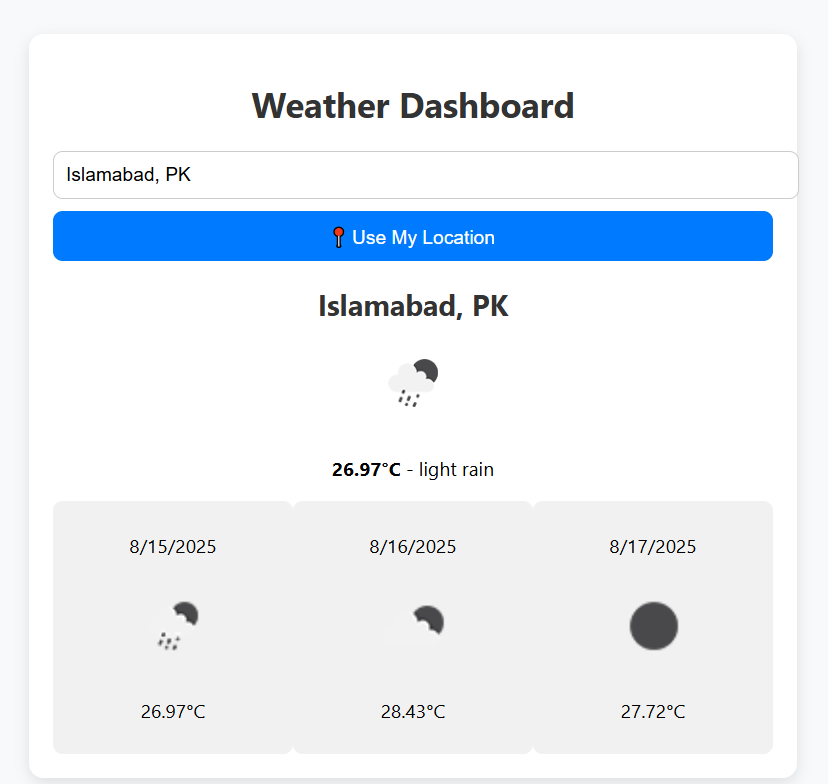

# 🌦 Real-Time Weather Dashboard

A clean, minimal, and responsive **real-time weather dashboard** built with **HTML, CSS, and JavaScript** using the [OpenWeatherMap API](https://openweathermap.org/api).  
It allows users to:

- Search for weather data by city.
- View **real-time weather** details (temperature, conditions, icons).
- Get a **3-day forecast**.
- Automatically detect and display the **current location** weather.
- See **city suggestions while typing**.
- Enjoy a **modern UI** with loading states.

---

## 🚀 Features

- **Live Weather Data** – Fetches data from OpenWeatherMap in real time.
- **Multiple Cities** – Search for and display weather from any city.
- **City Suggestions** – Autocomplete suggestions while typing.
- **3-Day Forecast** – See upcoming weather trends.
- **Current Location Support** – Auto-fetches weather for your location using geolocation.
- **Clean & Minimal UI** – Modern styling for a smooth experience.

---

## 📸 Screenshot

---

## 🛠️ Tech Stack

- **HTML5**
- **CSS3** (Modern responsive design)
- **JavaScript (ES6+)**
- **Axios** or **Fetch API**
- **OpenWeatherMap API**
- **Geolocation API**

---

## 📂 Project Structure

